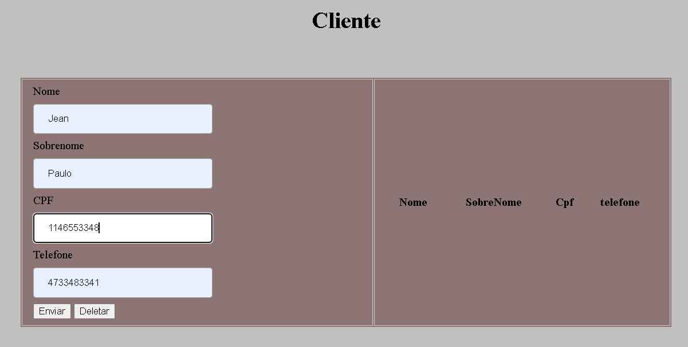
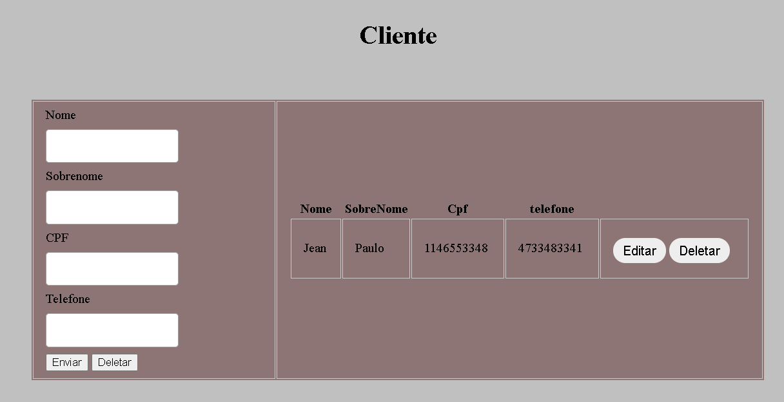
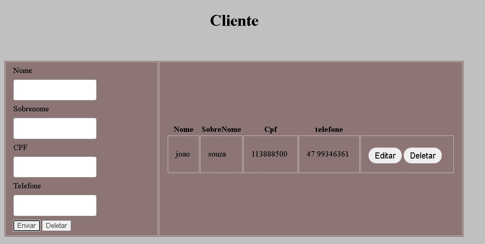
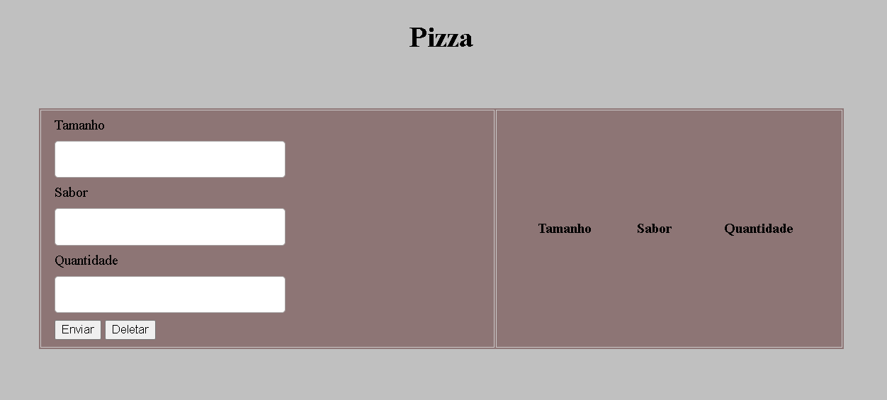
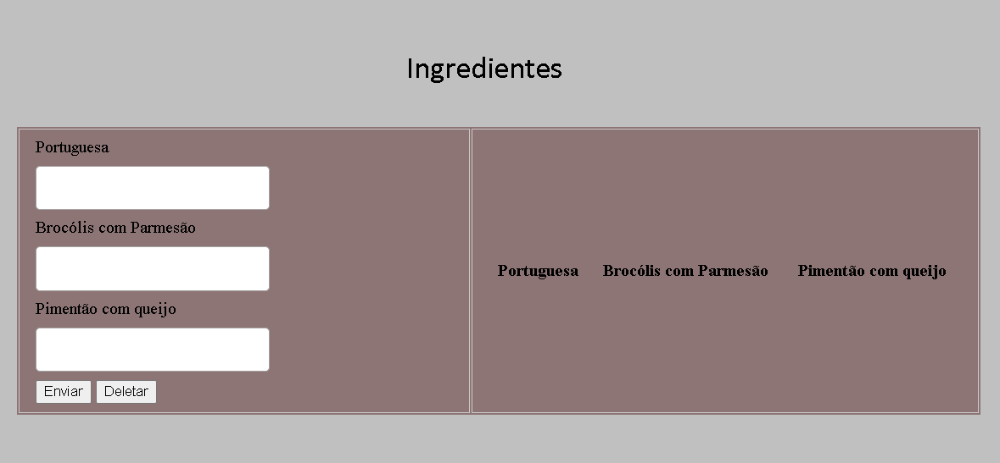

crud feito em html e css , javascript

crud simples , com objetivo de / Criar, ler, atualizar e excluir /

exemplo crição de uma classe cliente.

podemos enviar as informações.

apertando em enviar as informações ficão salva 

podendo editar , atualizar ou excluir.

as quatro interface do protótipo para o trabalho how da univali.

